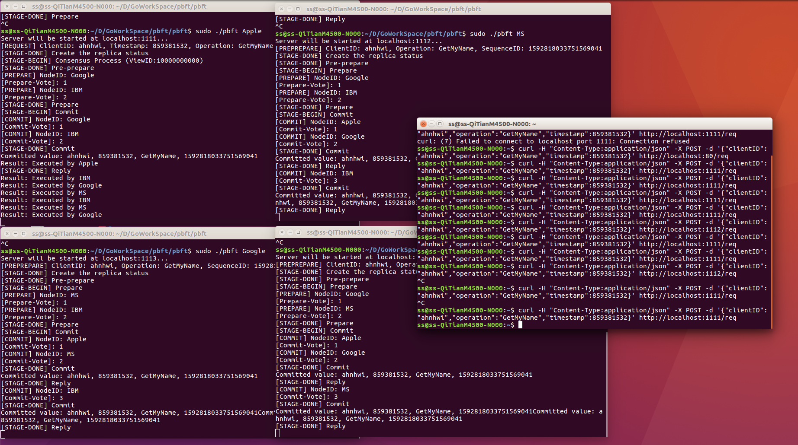

# Sample implementation of various consensus algorithms

## PBFT
### Architecture
#### Overall behavior (4 peers)

Definitions of each abbreviation in the diagram are;

* `m`: Request message object
* `c`: Client ID
* `t`: Timestamp
* `v`: View ID
* `n`: Sequence ID
* `i`: Peer(Node) ID
* `r`: Result of the request's operation

##### Why `count >= 2` ?
In the diagram, the peer change its state to `prepared` or `committed` when the `count` value, which is the number of verified messages from other peers, is larger than `2`.
Actually, the condition is `count >= 2*f` where `f` is the maximum number of faulty peers, which the network can tolerate. In this case, `f` is just `1`, so the condition is `count >= 2`. 

##### What is the reply message?
Every node replies the result of the request's operation to the client individually. The client will collect these reply messages and if `f + 1` valid reply messages are arrived, the client will accept the result.
In this sample implementation, there is no client. So, every node including the primary will return its reply message to the primary.

#### Code structure of the implementation

Go语言实现PBFT算法 下载demo后无法使用IDE运行，需要是用终端(命令行)工具输入指令运行

需要进入到pbft文件夹下，使用命令go build main.go然后使用./main Apple会有一些输出， 然后新建一个终端再进入到pbft文件夹下，使用命令./main MS 然后新建一个终端再进入到pbft文件夹下，使用命令./main Google 然后新建一个终端再进入到pbft文件夹下，使用命令./main IBM，最后使用curl命令执行

注意：一定要按顺序运行以上命令

curl -H "Content-Type:application/json" -X POST -d '{"clientID":"ahnhwi","operation":"GetMyName","timestamp":859381532}' http://localhost:1111/req

### Working Screenshot

## License
Apache 2.0

